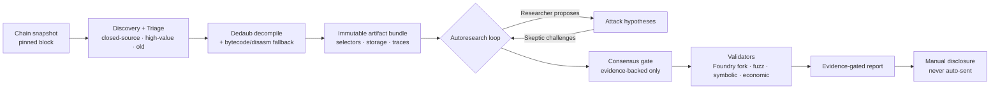

# Autonomous Audit Agents

**An AI agent pipeline that autonomously researches vulnerabilities in closed-source EVM smart contracts — published as a concept demonstration.**

[**▶ Live demo**](https://defaultperson.github.io/audit-agents-system/) · [Reference code](src/)

> ⚠️ **Research & educational concept.** This repository demonstrates a *methodology*. It is **not** a turnkey tool: it ships with no credentials and no live target lists, and the offensive defaults are disabled. Use only on testnets or contracts you are explicitly authorized to assess. Findings are meant to be disclosed responsibly and **manually** — the pipeline never contacts a contract owner on its own.

---

## Why this exists

In late May 2026, Anthropic's **Opus 4.8**, running an autonomous auditing agent at max effort, independently found a **critical, four-year-old soundness bug in Zcash's Orchard shielded pool** — a single missing copy-constraint in a halo2 ZK gadget that allowed undetectable in-pool counterfeiting. It was disclosed responsibly and fixed via an emergency soft fork and the NU6.2 hard fork; no exploitation was found (public since the June 5, 2026 disclosure).

The lesson generalizes:

> If a frontier model can autonomously find a bug that humans missed for four years in heavily-audited cryptography, **the same autonomous-research method applies to the millions of unaudited, closed-source contracts deployed on EVM chains.**

This repo is a concept demonstration of that method, applied to EVM bytecode.

## The method

1. **Snapshot & triage** — pin a block, then pick the most promising targets: closed-source (unverified) bytecode, high value, old.
2. **Decompile** — recover Solidity-like code with Dedaub, with a bytecode/disassembly fallback. *Decompiled names are hints, not facts.*
3. **Artifact bundle** — freeze an immutable evidence set per target: recovered selectors, storage samples, recent traces, balances.
4. **Autoresearch loop** — two different models argue. A **Researcher** proposes concrete attack hypotheses; a **Skeptic** (a different model family) attacks the preconditions, access control, and impact. They iterate across specialist domains (auth/upgradeability, proxy/storage/delegatecall, accounting & share math, oracle/price/liquidity, lifecycle, reentrancy). A deterministic **consensus gate** only lets a hypothesis through if it cites a real selector, explicit preconditions, an expected impact, a validation method, and at least one supporting fact.
5. **Validate** — evidence-gated: Foundry pinned-fork test → ItyFuzz → symbolic (Mythril/Halmos) → economic sanity. Only validated findings reach a report. Disclosure stays manual.

## Why it's universal

- **Chain-agnostic.** EVM chain adapters ship for Ethereum, BSC, Base, Polygon, and Arbitrum; new chains are one adapter (chain id, RPC, explorer, native currency).
- **Domain-agnostic loop.** The Researcher/Skeptic + evidence-gate loop is independent of EVM — the Zcash/Opus example shows the same shape of autonomous research finding bugs in an entirely different domain (ZK circuits).

## Explore

- **[Live demo →](https://defaultperson.github.io/audit-agents-system/)** — animated walkthrough of the pipeline.
- **[`src/`](src/)** — the reference implementation (Python 3.12): the autoresearch loop, evidence gate, validators, RAG, and chain adapters, shown as illustration.

## License

[MIT](LICENSE). See [SECURITY.md](SECURITY.md) for the responsible-use policy.
