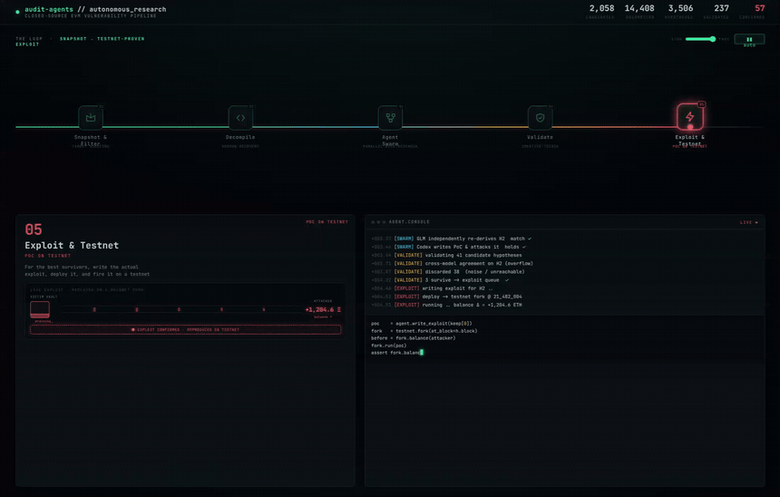

# Autonomous Audit Agents

  

**An AI agent pipeline that autonomously researches vulnerabilities in closed-source EVM smart contracts – a concept demonstration.**

[**▶ Live demo – how it works**](https://defaultperson.github.io/audit-agents-system/) · [Workflow manifest](MANIFEST.md)

> ⚠️ Research & educational concept. Ships with no credentials, no target lists, and with the offensive defaults disabled. Use only on testnet or contracts you are authorized to assess; disclosure is manual.

## Why

Crypto exploits have surged – **~$3.4B stolen in 2025** – and 2026 keeps the streak going:

- **Truebit Protocol** – Jan 2026, **~$26M** (8,540 ETH). An integer overflow in a bonding-curve price function returned a *zero* price for a crafted mint, so the attacker minted tokens for free and drained the reserves. The contract was **~5 years old, unverified, and unaudited**.
- **Whalebit** – Mar 2026, **~$824K**. Flash-borrowed tokens were dumped into a thin Algebra pool to move its spot-price oracle, letting helper contracts withdraw far more than they deposited.
- **Huma Finance** – May 2026, **~$101K**. Large credit lines were gated behind an approval step, but `requestCredit()` / `refreshAccount()` were open to anyone and silently flipped a line to "good standing" – a plain access-control bypass.

*(Reproducible PoCs for all three live in [DeFiHackLabs](https://github.com/SunWeb3Sec/DeFiHackLabs).)*

How are so many bugs being found and drained so fast – often in *old, closed-source* contracts nobody had looked at in years?

This repo is **one hypothesis about how**: that part of the wave is automated, AI-driven vulnerability research at scale. *([Speculation] – a concept demonstration of a plausible method, not a claim about any specific attacker.)*

The capability is clearly real: in May 2026, Anthropic's Opus 4.8, running an autonomous auditing agent, independently found a four-year-old soundness bug in Zcash's Orchard pool. This repo points that same autonomous-research loop at closed-source EVM contracts.

## Explore

- **[Live demo →](https://defaultperson.github.io/audit-agents-system/)** – interactive walkthrough of the method.
- **[`src/`](src/)** – the reference implementation (Python 3.12), shown as illustration.

## License

[MIT](LICENSE) · responsible-use policy in [SECURITY.md](SECURITY.md).
